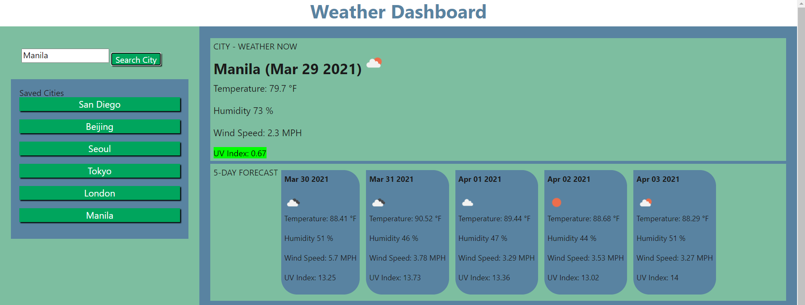

# 06 Server-Side APIs: Weather Dashboard

## Description
A Weather Dashboard with form input, used to search for a city with the results of both current and future(5 day forecast) weather conditions, added severity visuals for the UV index and saves the searched city for future purposes. This app will run in the browser and feature dynamically updated HTML and CSS, Date UNIX codes are converted by the use of Moment.js library.

- This app is a work of fetch and getting datas from other APIs (to be specific, the weather API https://openweathermap.org/), Lots of DOM traversing, conditional checks, array/object iterations, saving and getting from local storage. Learned from Week 3 (22 MAR - 26 MAR) 
- For travelers, to see the weather outlook for multiple cities(to be specific, name of the city they want to go or currently in) so that they can plan a trip accordingly.

### Screenshots
The following image shows the web application's appearance and functionality:

- The index.html

- Style on hovers

- When searching city screenshot

- Search results screenshot

#### URLs
https://irvinek01.github.io/Homework6-Weather-Dashboard/
https://github.com/irvinek01/Homework6-Weather-Dashboard

##### SPECIAL THANKS
- https://openweathermap.org/

- Mr. John
- Maam Janani
- My Whole class
- Would like to commend the following persons for helping directly(guiding me what to do next)/indirectly(asking questions to the instructors that I'm not aware of):
  ~ Elvis Lee
  ~ Oliver Shi
